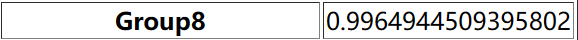

# 基于弱学习器的查询规模预测<br/>模型设计与调优<br/>石依凡  2020202264<br/>徐一宸  2020201432

<strong style="font-size: large">内容目录</strong>

[TOC]

## 1  实验概述

### 1.1  任务要求

本实验需要针对给定的SQL查询和表特征，使用机器学习的方法，估算查询结果的规模（Cardinality）。SQL查询的训练集由`train.csv`文件给出，表特征由`column_min_max_vals.csv`文件给出，需要估算的测试集由`test_without_label.csv`文件给出。

测试集和训练集由逗号分隔值（CSV）格式给出。下面的SQL语句：

<div style="page-break-after: always;"></div>

```sql
SELECT COUNT(*)
FROM Table_0 Alias_0, Table_1 Alias_1, ... # And Other Tables
WHERE Alias_k0.Column_t0 = Alias_k1.Column_t1 AND ... # And Other Join-Statements
AND Alias_r0.Column_s0 [op_0] Const_0 AND ... # And Other Condition Statements
```

等价于为下面的CSV行：

```
Table_0 Alias_0,Table_1 Alias_1...#
Alias_k0.Column_t0=Alias_k1.Column_t1...#
Alias_r0.Column_s0,[op_0],Const_0...#
result
```

例如：`SELECT COUNT(*) FROM movie_companies mc WHERE mc.company_type_id < 2`，结果是`1274246`，用`movie_companies mc##mc.company_type_id,<,2#1274246`表示。

我们的目标就是由$10000$条测试数据训练机器学习模型，并给出$2000$条测试数据的规模预测值。评估损失函数为均方对数误差（MSLE）函数。

### 1.2  模型介绍

在本次作业中，我们采取的是XGBoost的模型。

 XGBoost（极端梯度提升，Extreme Gradient Boosting）是一种基于决策树的集成机器学习算法，使用梯度上升框架，适用于分类和回归问题，并且主要用来解决有监督学习问题。集成学习，则是指构建多个分类器（弱分类器）对数据集进行预测，然后用某种策略将多个分类器预测的结果集成起来，作为最终预测结果。因此，集成学习很好的避免了单一学习模型带来的过拟合问题。XGBoost就是这样一种高效的机器学习算法，它通过构建弱学习器的集成，来提高模型的预测准确度。

XGBoost 具有以下优点：
1. 可以自动学习特征的重要性，并进行特征选择。
2. 具有高度的可扩展性，可以使用并行计算来提高训练速度。
3. 可以通过调整超参数来优化模型的性能。
4. 可以处理高维度和大规模的数据。

我们之所以使用XGBoost模型，同时也因为本次试验数据量较大，数据维数较多，相较于其他机器学习算法，XGBoost能够在SQL查询数据集中有着更好的表现，能够很好地预测查询的规模（Cardinality）。

综上，在本次实验中，我们选择XGBoost回归器（XGBoost Regressor）作为最终的机器学习模型。


### 1.3  我们的工作

####  1.3.1  实验环境

本次实验使用Jetbrains Pycharm集成开发平台，Python版本为Python $3.6.8$。用到的软件包有：

* `scikit-learn`：用于划分训练集、验证集，指定损失函数
* `pandas`：用于数据框操作
* `numpy`：用作基本数据类型
* `math`：提供基本数学函数
* `xgb`：提供XGBoost框架

开发环境为：AMD Ryzen 9 7950X （32GB内存）。

#### 1.3.2  架构说明

1. 对给出的表数据做数据预处理和数据分析，以便得知数据的大致分布和规模。
2. 对查询条件进行编码，得到编码后的向量组作为训练集，以便投入机器学习模型进行学习和迭代。
3. 选择一个效果相对较好的机器学习模型，使用模型进行训练，预测出测试集的结果 
4. 对选定的模型进行参数调整，提升模型的的预测准确度。

####  1.3.3  取得的结果

在助教提供的测试网站上，我们取得了较好的效果，测试集的MSLE达到了$1.0514347331312608$。如下图所示：



####  1.3.4  展望

在本次实验中，由于没有具体的数据，我们只能通过建模回归的方法来对给出的SQL查询条件进行规模预测。未来如果想要让预测的准确率更好，我们可以进一步改进编码模式，尝试更多的、与测试集数据更加匹配的机器学习、神经网络甚至深度学习模型，争取能够达到更好的表现，给用户更加良好的体验。

<div style="page-break-after: always;"></div>

## 2  具体实现

### 2.1  数据特征分析

在对训练集、测试集做初步分析后，我们得出以下的结论：

* 待预测的自变量有且仅有三个组成信息：表信息、连接信息和条件信息。
* 一共有$6$个表出现在数据集中；
* 考虑到连接操作的实际意义，一共有$5$种有效的连接操作出现在数据集中；
* 一共有$18$种不同的数据列作为条件的一部分；
* 所有的条件都是值不相关的，也就是说条件的右值一定是常量。

### 2.2  编码实现

基于上述的数据集特征，我们分别对每一次查询的表信息、连接信息和条件信息进行编码，拼接形成最终的向量。这种方法类似于独热编码，有效地整合且结构化了原有查询的所有信息。如下所示：
$$
Vec_{query}(q)=\mathbf{join} \{ \sigma_{table}(q),\sigma_{join}(q),\sigma_{condition}(q) \}
$$
表信息的分向量共$6$维，维度$i$的值表示即第$i$张表是否存在于查询中：
$$
\sigma_{table}(q)[i]:=\text{Table}_i\in q
$$
连接信息的分向量共$5$维，维度$i$的值表示即第$i$个连接条件是否存在于查询中：
$$
\sigma_{join}(q)[i]:=\text{Join}_i\in q
$$
条件信息的分向量共$36$维，维度$2i$和$2i+1$的经过标准化的值表示如下（$0\le i\le 17$）：
$$
\sigma_{condition}(q)[2i]:=scaler(\text{Condition}_i.lower\_bound)\\
\sigma_{condition}(q)[2i+1]:=scaler(\text{Condition}_i.upper\_bound)\\
scaler(x):=\frac{x-\text{minVal}}{\text{maxVal}-\text{minVal}}
$$
对于不存在的条件，向量值均为$0$。

<div style="page-break-after: always;"></div>

### 2.3  模型训练

在具体实现上，我们主要用到了`sklearn`和`xgb`相关的模型：
```python
from sklearn.model_selection import train_test_split
from sklearn.metrics import mean_squared_log_error, accuracy_score, mean_squared_error
from sklearn.model_selection import GridSearchCV
from sklearn.preprocessing import MinMaxScaler
from sklearn.preprocessing import StandardScaler
import xgboost as xgb
from xgboost import XGBRegressor, XGBClassifier
from sklearn.neighbors import KNeighborsClassifier, KNeighborsRegressor
from sklearn.ensemble import AdaBoostClassifier, AdaBoostRegressor
from sklearn.tree import DecisionTreeClassifier, DecisionTreeRegressor
```

我们采用`train_test_split`来对训练集进行分割；采用`mean_squared_log_error`和`accuracy_score`来对验证集进行评分，从而判断在当前参数下模型的优秀程度；采用`GridSearchCV`进行参数调优。

在模型的选用上，我们对各种模型的分类器和回归器都进行了测试，结果是显然的——本次实验更加适用于回归器。除了XGBoost模型之外，我们还尝试了KNN模型、AdaBoost模型以及决策树模型（Decision Tree），在对比之下，最后选择了相对更优的XGBoost模型。

我们通过多次对比实验，选取表现更好的XGBoost回归器作为最终的模型。然后在使用样本训练之后，预测出最终的测试结果，并通过`pandas`库输出至结果文件，提交至测评网站。

## 3  调优与评估

我们把整个训练集按照$1:0.05$的比例划分成更小的训练集$X_{train}$和验证集$X_{validation}$。我们通过对验证集进行预测的到的结果就可以在本地来调整模型。

在调参过程中，我们着重关注的参数有以下这些：

**XGBoost框架参数(General parameters)：**

* n_estimators [ default = $100$ ]
  * n_estimators则是非常重要的参数，它关系到我们XGBoost模型的复杂度。
  * 它代表了我们决策树弱学习器的个数。这个参数对应sklearn GBDT的n_estimators。
  * n_estimators太小，容易欠拟合，n_estimators太大，模型会过于复杂，需要选择一个适中的数值。
* objective \[ 回归default = reg:squarederror \] \[ 多分类default = multi:softmax \]
  * objective代表了我们要解决的问题是分类还是回归，或其他问题，以及对应的损失函数。
  * 具体可以取的值很多，我们只关心在分类和回归的时候使用的参数。在回归问题中使用reg:squarederror ，即MSE均方误差，多分类问题中使用multi:softmax。

**XGBoost 弱学习器参数(Booster parameters)：**

* learning_rate [default = $0.3$ ]
  * learning_rate控制每个弱学习器的权重缩减系数，和sklearn GBDT的learning_rate类似，较小的learning_rate意味着我们需要更多的弱学习器的迭代次数。
  * 通常我们用步长和迭代最大次数一起来决定算法的拟合效果。所以这两个参数n_estimators和learning_rate要一起调优才有效果。当然也可以先固定一个learning_rate ，然后调完n_estimators，再调完其他所有参数后，最后再来重新调整learning_rate和n_estimators。
* max_depth [ default = $6$ ]
  * 控制树结构的深度， 数据少或者特征少的时候可以不管这个值。
  * 如果模型样本量多，特征也多的情况下，需要限制这个最大深度， 具体的取值一般要网格搜索调参。这个参数对应sklearn GBDT的max_depth。在训练深树时，XGBoost会大量消耗内存。
* gamma [ default = $0$ ]
  * XGBoost的决策树分裂所带来的损失减小阈值。

针对参数调优，我们采用网格搜索和交叉验证（GridSearchCV）的方法，即在指定的参数范围内，按步长依次调整参数，利用调整的参数训练学习器，从所有的参数中找到在验证集上精度最高的参数，是一个训练和比较的过程。$k$折交叉验证将所有数据集分成$k$份，不重复地每次取其中一份做测试集，用其余$k-1$份做训练集训练模型，之后计算该模型在测试集上的得分,将$k$次的得分取平均得到最后的得分。GridSearchCV可以保证在指定的参数范围内找到精度最高的参数。

参数调优的Python代码如下所示。这里展示了我们调整`learning_rate`的过程，最终取`learning_rate = 0.18`，最终的损失最小。

<div style="page-break-after: always;"></div>

```python
# xgboost 调参
# cv_params = {'n_estimators': [447,457,467]} #457 is the best
# cv_params = {'max_depth': [4,5,6,7,8,9], 'min_child_weight': [1,2,3,4,5,6]} #9,4 is the best
# cv_params = {'gamma': [0,0.1,0.2,0.3,0.4,0.5,0.6,0.7]} #0 is the best
# cv_params = {'subsample': [0.6, 0.7, 0.9, 0.9], 'colsample_bytree': [0.6, 0.7, 0.9, 0.9]} #both 0.9 is the best

cv_params = {'learning_rate': [0.08,0.18,0.28]} #0.18 is the best
other_params = {'n_estimators':457,'learning_rate': 0.18}
model = XGBRegressor(**other_params)

optimized_GBM = GridSearchCV(estimator=model, param_grid=cv_params, scoring='r2', cv=5, verbose=1, n_jobs=4)
optimized_GBM.fit(X_train, Y_train)
evalute_result = optimized_GBM.cv_results_['mean_test_score']
print('Each iteration result: {0}'.format(evalute_result))
print('The best argument values: {0}'.format(optimized_GBM.best_params_))
print('The best model score: {0}'.format(optimized_GBM.best_score_))
```

我们每次选择不同的参数或者参数组合，输入到`sklearn`提供的`GridSearchCV`函数中，并得到局部的参数最优解。

| 序号  | n_estimators | learning_rate | MSLE      |
| ----- | ------------ | ------------- | --------- |
| 1     | 447          | 0.08          | 1.070     |
| 2     | 447          | 0.18          | 1.052     |
| 3     | 447          | 0.28          | 1.118     |
| 4     | 457          | 0.08          | 1.070     |
| **5** | **457**      | **0.18**      | **1.051** |
| 6     | 457          | 0.28          | 1.118     |
| 7     | 467          | 0.08          | 1.070     |
| 8     | 467          | 0.18          | 1.052     |
| 9     | 467          | 0.28          | 1.118     |

上表是部分我们尝试不同参数下的损失结果。对比之后，最终我们形成的相对最优模型如下所示： 

```python
model = XGBRegressor(n_estimators=457, learning_rate=0.18, max_depth=5, gamma=0.2)
```

## 4  总结与展望

本次实验以SQL查询为背景，以估算查询规模为导向，极大程度上锻炼了我们对于现实问题的建模能力，提升了我们的抽象思维，深化了我们对课上机器学习方法以及课后具体的机器学习算法的认识。在这次实验中，我们手动实现了对数据的挖掘、编码、建模和分析，充分地提升了我们对于机器学习算法五个“标准组件”的理解，让我们感受到了它的灵活与强大。在今后的学习生活中，我们会继续保持探索精神，用在本次实验中习得的思想与方法解决生活中的实际问题。

<div style="page-break-after: always;"></div>

## 参考文献

[1] Kipf, A., Kipf, T., Radke, B., Leis, V., Boncz, P., & Kemper, A. (2018). Learned cardinalities: Estimating correlated joins with deep learning. arXiv preprint arXiv:1809.00677.

[2] Dutt, A., Wang, C., Narasayya, V., & Chaudhuri, S. (2020). Efficiently approximating selectivity functions using low overhead regression models. Proceedings of the VLDB Endowment, 13(12), 2215-2228.

[3] Chen, T., He, T., Benesty, M., Khotilovich, V., Tang, Y., Cho, H., & Chen, K. (2015). Xgboost: extreme gradient boosting. R package version 0.4-2, 1(4), 1-4.

[4] Shehadeh, A., Alshboul, O., Al Mamlook, R. E., & Hamedat, O. (2021). Machine learning models for predicting the residual value of heavy construction equipment: An evaluation of modified decision tree, LightGBM, and XGBoost regression. Automation in Construction, 129, 103827.

[5] Park, Y., Zhong, S., & Mozafari, B. (2020, June). Quicksel: Quick selectivity learning with mixture models. In Proceedings of the 2020 ACM SIGMOD International Conference on Management of Data (pp. 1017-1033).